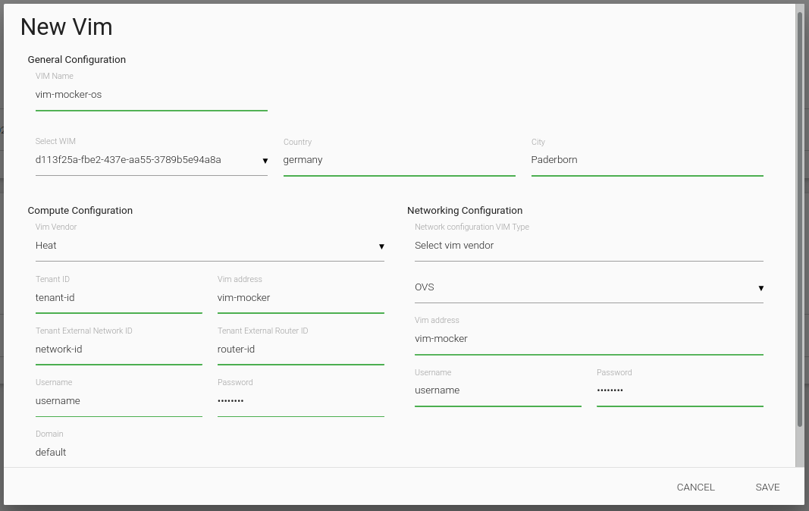

# VIM Mocker

## Instructions to run for Pishahang

Make sure the image you are trying to test is defined in the following file, `vim-mocker/app/pishahang-os/glance/static_response.py`. simply change the `name` to reflect the image name that your trying to instantiate. (according to pishahang naming scheme)

    git clone https://github.com/CN-UPB/MANO-Benchmarking-Framework.git
    cd MANO-Benchmarking-Framework
    cd vim-mocker
    ./build_run_docker_pishahang_os_remote.sh

Once the docker container is started. simply add the following VIM details to pishahang. 

